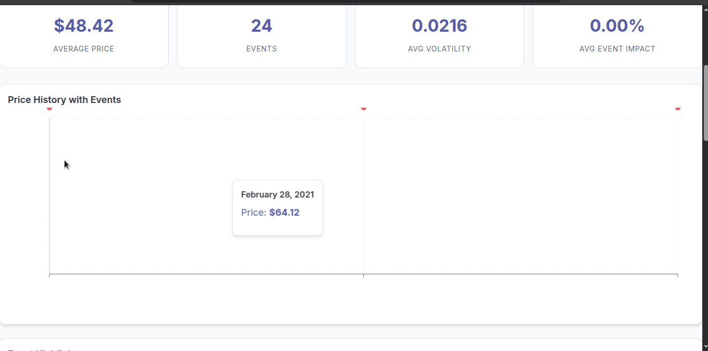

# Brent Oil Change Point Analysis Dashboard

A full-stack data science project for Brent crude oil prices, combining Bayesian change point detection, event impact analysis, and a modern dashboard for stakeholders.



> Add your demo GIF at [docs/dashboared.gif](docs/dashboared.gif).

## Why This Matters
Birhan Energies supports investors, policymakers, and energy companies. This project connects geopolitical and economic shocks to Brent price regimes so decisions are grounded in evidence, not guesswork.

## Key Objectives
- Detect structural breaks in Brent prices with Bayesian change point modeling.
- Quantify how major events shift price levels and volatility.
- Deliver a clear, interactive dashboard for exploration and reporting.

## Dataset
- Daily Brent prices from 1987-05-20 to 2022-09-30.
- Event catalog with geopolitical, policy, and economic shocks.

Core data files:
- [data/raw/BrentOilPrices.csv](data/raw/BrentOilPrices.csv)
- [data/events/enhanced_events.csv](data/events/enhanced_events.csv)

## Methodology (Task 2)
- Log-returns for stationarity: $\log(\text{Price}_t) - \log(\text{Price}_{t-1})$.
- Bayesian change point model with a discrete $	au$ prior.
- Separate pre/post parameters for mean and volatility.
- MCMC sampling with convergence checks (R-hat, ESS).

Model outputs are saved to:
- [models/oil_cp_results.json](models/oil_cp_results.json)
- [models/single_cp_results.json](models/single_cp_results.json) (if generated)

## Dashboard Features (Task 3)
- **Overview**: historical price trend with event overlay + KPI cards.
- **Change Points**: detected change date, 95% HDI, parameter shifts, nearby events.
- **Event Impact**: scatter plot of price changes + drill-down detail panel.
- **Volatility**: rolling volatility series + event volatility comparison.

## API Endpoints (Flask)
- `GET /api/prices` (filters: `start_date`, `end_date`, `resample`)
- `GET /api/events` (filters: `event_type`)
- `GET /api/analysis/summary`
- `GET /api/analysis/changepoints`
- `GET /api/analysis/event-impact/<event_title>`
- `GET /api/analysis/volatility` (filters: `window`, `start_date`, `end_date`)
- `GET /api/analysis/correlation`

Backend entry point: [dashboard/backend/app.py](dashboard/backend/app.py)

## Quick Start (Local)

### 1) Backend
```bash
cd dashboard/backend
python -m venv venv
source venv/bin/activate
pip install -r requirements.txt
python app.py
```

### 2) Frontend (Dev)
```bash
cd dashboard/frontend
npm install
npm start
```

### 3) Frontend (Flask-served)
```bash
cd dashboard/frontend
npm run build
# restart Flask after build
```

Open:
- http://localhost:5000/dashboard

## Project Structure
```
brent-oil-event-analysis/
├── dashboard/
│   ├── backend/             # Flask API
│   └── frontend/            # React dashboard
├── data/                    # Raw and event datasets
├── models/                  # Bayesian change point outputs
├── docs/                    # Task documentation + dashboard GIF
├── reports/                 # Task 2 report
└── README.md
```

## Deliverables Mapping
- Task 1 docs: [docs/task1_analysis_plan.md](docs/task1_analysis_plan.md), [docs/assumptions_limitations.md](docs/assumptions_limitations.md), [docs/communication_plan.md](docs/communication_plan.md)
- Task 2 code: [src/bayesian_model_enhanced.py](src/bayesian_model_enhanced.py)
- Task 3 dashboard readme: [docs/task3_dashboard_readme.md](docs/task3_dashboard_readme.md)

## Troubleshooting
- **Port 5000 in use**: stop the existing Flask process (Ctrl+C) or run on a different port.
- **Change point missing**: confirm model results exist in [models/oil_cp_results.json](models/oil_cp_results.json).
- **Static assets 404**: run `npm run build` in [dashboard/frontend](dashboard/frontend).

## License
MIT
